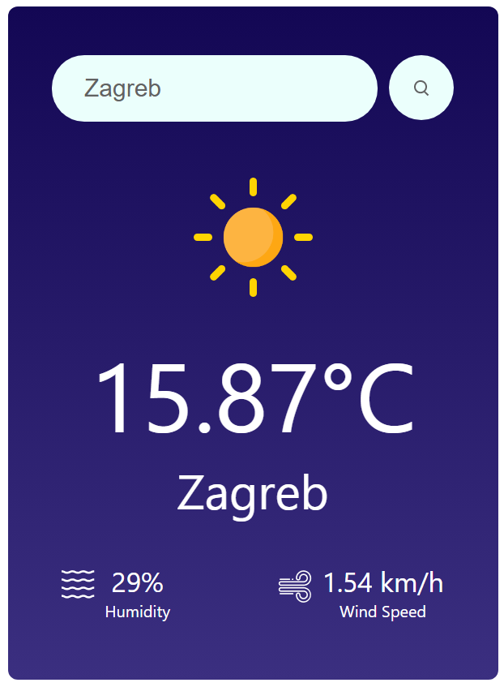

# Fullstack Weather App



## Overview

This fullstack weather app provides real-time weather updates and forecasts for any location worldwide.

## Features

- **Current Weather**: Get real-time weather updates.
- **Location Search**: Search for weather information in any city.
- **User-friendly Interface**: Intuitive design for easy navigation.

## Technologies Used

- **Frontend**: ReactJS
- **Backend**: Python, Flask
- **APIs**: OpenWeatherMap API

## Setup

1. **Clone the repository**:

    ```
    git clone https://github.com/TheBrunoPetkovic/Weather-App.git
    ```

2. **Install dependencies**:

    ```
    npm install <whatever is underlined when you open code>
    ```

3. **Start the application**:

    ```
    frontend - npm start 
    backend - run it however you prefer
    ```

4. **Open the app in your browser**:

    Visit `http://localhost:3000`, or any link provided when you run frontend.

## Contributing

Contributions are welcome! Please submit a pull request or open an issue for bugs or suggestions.
